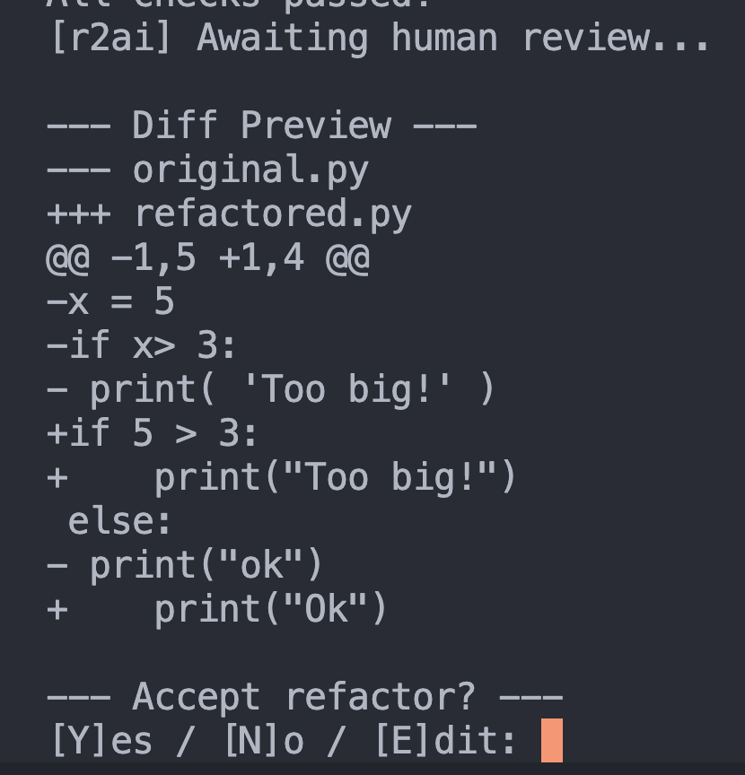

# R2AI: Autonomous Code Refactor Agent

**R2AI** is a semi-autonomous Python refactoring agent built using [LangGraph](https://github.com/langchain-ai/langgraph). It analyzes and improves Python code structure using Ruff, refactors it via LLM, and supports human-in-the-loop review with feedback that can trigger iterative improvements. Able to run two different LLMs for reasoning: local Ollama runner with Mistral or ChatGPT cloud API's

---

- after Refactoring code Human may: Accept, Reject, or Edit and make the Agent refactor more

---

## ✨ Features

- 🧠 LangGraph-based modular state machine architecture
- 🔍 Linting and static analysis with [Ruff](https://docs.astral.sh/ruff/)
- 💡 LLM-driven refactoring using either [Ollama](https://ollama.ai/) or OpenAI
- 🧑‍⚖️ Human-in-the-loop review and decision flow
- 🔁 Iterative refactoring based on human feedback
- 📂 Batch processing of entire folders of `.py` files
- 🧪 Unified diff preview before write
- 💬 Optional human edits that drive re-refactoring
- 🚀 Ready for GitHub PR automation (coming next)

---

## 🧰 Tech Stack

- **LangGraph** – defines the stateful agent flow
- **LangChain** – LLM interface and abstraction
- **Ollama / OpenAI** – for code refactoring language model
- **Ruff** – Python linter and formatter
- **Python 3.10+** – managed via [Poetry](https://python-poetry.org/)

---

## 📂 Project Structure

    r2ai/
    ├── agent/
    │   ├── main.py                   # CLI entry point
    │   ├── graph.py                  # LangGraph workflow definition
    │   ├── llm.py                    # Select and instantiate LLM
    │   ├── nodes/                    # Modular LangGraph node functions
    │   └── tools/visualize_graph.py  # Renders LangGraph diagram
    ├── assets/
    │   └── graph.svg                 # Visualized LangGraph structure

---

## 🚀 Getting Started

### 1. Install dependencies

    poetry install

### 2. Run on a single file

    poetry run r2ai --model ollama --file path/to/file.py

### 3. Run on a folder

    poetry run r2ai --model gpt --path ./src/

---

## 🔄 Workflow Overview

1. Ingest and lint code with Ruff
2. Determine if refactor is needed
3. If needed, refactor with LLM
4. Re-analyze refactored code
5. Present unified diff for human approval
6. Human may:
   - Accept ✅
   - Reject ❌
   - Edit and retry ♻️
7. Final output is written + simulated PR message generated

---

## 🧠 Agent Architecture

R2AI uses LangGraph to define a stateful and conditional agent:

- Deterministic edge decisions (e.g. Ruff → Refactor vs Skip)
- Human-directed feedback loops (`Edit → Re-Refactor`)
- State-passing between nodes
- Visualized via Mermaid and rendered to SVG

See [assets/graph.svg](assets/graph.svg) for a visual layout.

---

## 🗺️ Roadmap

- [x] Human-in-the-loop refactor flow
- [x] Multi-file batch processing
- [x] Mermaid → SVG agent diagram
- [ ] GitHub PR integration via `gh`
- [ ] Optional test runner validation
- [ ] Persistent memory and autonomous mode

---

## 📎 License

MIT License © Jacob MacInnis
